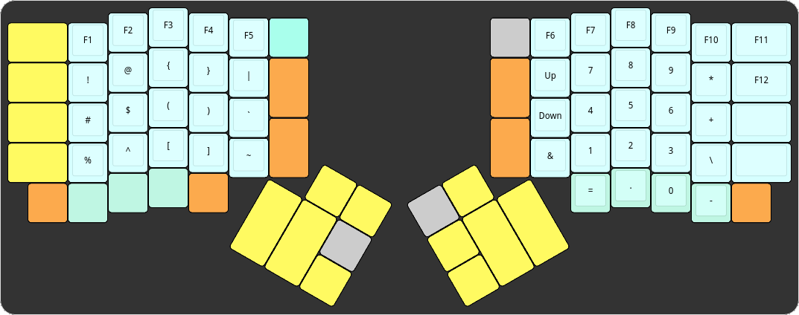
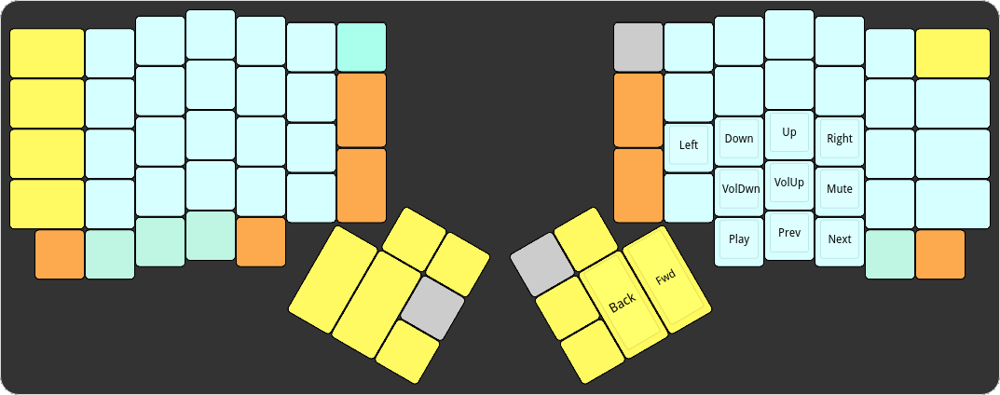

# ErgoDox EZ naps62 Configuration

## Table of Contents

* [Motivation](#motivation)
* [Key Features](#key-features)
* [Layers](#layers)
  - [Base Layer](#base-layer)
  - [Coder Layer](#coder-layer)
  - [Media Layer](#media-layer)
* [Tool](#tools)
  - [Keylogger](#keylogger)
* [Building](#building)
* [Author](#author)

## Motivation

I wanted a layout that suited my Linux & Vim usage. I also didn't like the lack of efficient access to some of the more common special characters used in programming.

## Key features / changes

N/A

## Layers

### Base Layer

[Open on keyboard-layout-editor.com](http://www.keyboard-layout-editor.com/#/gists/f9769c844e700f4d92239dba79f5723a)


* **No `MT(mod, kc)` keys (modifier when pressed, key when tapped).** Those keys work with a global timeout. When a key press is shorter than the timeout, it's considered a tap, otherwise it's a hold. I couldn't find any particular timeout that would work for me. I need to use mods extremely fast, but also want the confort of using them more slowly in other occasions. So I gave up on this feature altogether.
* **Direct access to `{}[]`.** When programming, these are used extremely often. I was still getting used to the coder layer, and I prefer the arrows on the home row, so I used the bottom-right keys for this.
* **Layer keys everywhere.** I either use my little finger or my index finger to go to L1, whichever is more confortable in any given situation. L2 is not used while coding/writing, so I don't need an extremely-optimized access to it.
* **Lang key.** This is nothing more than `Super-Space` combo, which in my systems (both Linux & Windows) is the shortcut to change the keyboard language. I'm Portuguese, so I often cycle between US layout for coding, and PT layout for writing.
* **Special chars on the right-most column.** I only use Ctrl & Shift keys on the left side, so I used the right keys to include some of the more useful special characters as well.

### Coder Layer

[Open on keyboard-layout-editor.com](http://www.keyboard-layout-editor.com/#/gists/afa546a6b0b9c0ec78147afc6ef9250c)



* The `=` and `-` signs where nowhere to be found. `-` was already on the base layer, but it's still useful to have a fully-featured NumPad on the coder layer.

### Media Layer

[Open on keyboard-layout-editor.com](http://www.keyboard-layout-editor.com/#/gists/801ba0ae4d340d73df70588329e995ed)



* **Better media keys**. Why was Play/Pause so far away? And where was Mute? I put all my media keys close to each other, including the missing ones
* **Arrow keys on home row.** I use vim, so I'm always on my home row. I use this sometimes to get around, but not as often as to need them on the base row. I'm fine with them here
* I don't use mouse keys. They're still set up, and I made some changes as an experiment, but I mostly forgot they exist by now.

## Tools

### Keylogger

For every key press, the keyboard will output a JSON-formatted line containing the position of
the key in the matrix.
This allows one to collect usage information, and to build analytics over it,
such as a heat map.

Keyboard output can be caught using `hid_listen`.

This functionality is enabled by default (via `KEYLOGGER_ENABLE` and
`AUTOLOG_ENABLE` in `Makefile`).

## Building

If you are reading this directly through [QMK firmware](https://github.com/jackhumbert/qmk_firmware)'s repository, you can build this layout with the standard method:

```bash
$ make keyboard=ergodox_ez keymap=naps62
```

If you're reading this from [my own
repository](https://github.com/naps62/ergodox-layout), then you'll need to
checkout this code into QMK's repository. Here's an example:

```bash
$ git clone https://github.com/jackhumbert/qmk_firmware.git
$ cd qmk_firmware
$ git clone https://github.com/naps62/ergodox-layout.git keyboards/ergodox_ez/keymaps/naps62
$ make keyboard=ergodox_ez keymap=naps62
```

## Author

[Miguel Palhas](https://github.com/naps62)
